# Traffic "Accidents" Involving Bicycles in Denver

## data acquisition

### data source - Denver Open Data

```r
  traffic_local <- "data/denver_traffic_accidents_full.csv"
```

### acquire the data from the open data repository

```r
  traffic_url <- "http://data.denvergov.org/download/gis/traffic_accidents/csv/traffic_accidents.csv""
  acquireAndSave(traffic_url, traffic_local)
```
### and, read from disk w/ transformation

```r
  traffic <- readDenverCrime(traffic_local)
```

### remove points with wildly inconsistent longitudes

```r
  # a valid denver longitude is ~-104
  traffic <- traffic[!(traffic$GEO_LON > -100), ]
```

### create new columns with time components

```r
  traffic$FIRST_OCCURRENCE_DATE <-
    as.POSIXct(traffic$FIRST_OCCURRENCE_DATE,format="%Y-%m-%d %H:%M:%S")
  traffic$REPORTED_DATE <-
    as.POSIXct(traffic$REPORTED_DATE,format="%Y-%m-%d %H:%M:%S")

  traffic$OCCURRENCE_HOUR <-
    as.numeric(format(traffic$FIRST_OCCURRENCE_DATE, "%H")) +
    as.numeric(format(traffic$FIRST_OCCURRENCE_DATE, "%M")) / 60

  traffic$OCCURRENCE_DAY <- 
    as.numeric(format(traffic$FIRST_OCCURRENCE_DATE, "%u"))

  traffic$OCCURRENCE_MONTH <- 
    as.numeric(format(traffic$FIRST_OCCURRENCE_DATE, "%m"))

  traffic$OCCURRENCE_YEAR <- 
    as.numeric(format(traffic$FIRST_OCCURRENCE_DATE, "%Y"))
```

### convenient data subsets

```r
  pedestrians <- traffic[traffic$PEDESTRIAN_IND %in% c(1), ]
  bicycles <- traffic[traffic$BICYCLE_IND %in% c(1), ]
```

## exploratory analysis

### General shape of the dataframe

```r
  head(traffic, 1)
```

```
##   INCIDENT_ID   OFFENSE_ID OFFENSE_CODE OFFENSE_CODE_EXTENSION
## 1  2013331514 2.013332e+15         5441                      0
##    OFFENSE_TYPE_ID OFFENSE_CATEGORY_ID FIRST_OCCURRENCE_DATE
## 1 traffic-accident    traffic-accident   2013-07-17 16:48:59
##   LAST_OCCURRENCE_DATE       REPORTED_DATE INCIDENT_ADDRESS   GEO_X
## 1                      2013-07-17 16:54:00                  3157251
##     GEO_Y   GEO_LON  GEO_LAT DISTRICT_ID PRECINCT_ID     NEIGHBORHOOD_ID
## 1 1709511 -104.9405 39.78009           2         221 northeast-park-hill
##   BICYCLE_IND PEDESTRIAN_IND OCCURRENCE_HOUR OCCURRENCE_DAY
## 1          NA             NA            16.8              3
##   OCCURRENCE_MONTH OCCURRENCE_YEAR
## 1                7            2013
```

```r
  str(traffic)
```

```
## 'data.frame':	125930 obs. of  23 variables:
##  $ INCIDENT_ID           : num  2.01e+09 2.01e+09 2.01e+09 2.01e+09 2.01e+09 ...
##  $ OFFENSE_ID            : num  2.01e+15 2.01e+15 2.01e+15 2.01e+15 2.01e+15 ...
##  $ OFFENSE_CODE          : Factor w/ 5 levels "5401","5420",..: 3 3 3 1 3 3 3 3 3 1 ...
##  $ OFFENSE_CODE_EXTENSION: Factor w/ 1 level "0": 1 1 1 1 1 1 1 1 1 1 ...
##  $ OFFENSE_TYPE_ID       : Factor w/ 5 levels "traf-vehicular-assault",..: 3 3 3 5 3 3 3 3 3 5 ...
##  $ OFFENSE_CATEGORY_ID   : Factor w/ 3 levels "all-other-crimes",..: 3 3 3 3 3 3 3 3 3 3 ...
##  $ FIRST_OCCURRENCE_DATE : POSIXct, format: "2013-07-17 16:48:59" "2013-05-21 09:04:59" ...
##  $ LAST_OCCURRENCE_DATE  : chr  "" "" "" "" ...
##  $ REPORTED_DATE         : POSIXct, format: "2013-07-17 16:54:00" "2013-05-21 15:21:59" ...
##  $ INCIDENT_ADDRESS      : chr  "" "1900 E BUCHTEL BLVD" "" "S LOWELL BLVD / W GREENWOOD PL" ...
##  $ GEO_X                 : num  3157251 3150708 3167776 3130885 3139350 ...
##  $ GEO_Y                 : num  1709511 1674532 1692387 1664949 1702436 ...
##  $ GEO_LON               : num  -105 -105 -105 -105 -105 ...
##  $ GEO_LAT               : num  39.8 39.7 39.7 39.7 39.8 ...
##  $ DISTRICT_ID           : Factor w/ 7 levels "1","2","3","4",..: 2 3 2 4 1 3 1 6 6 2 ...
##  $ PRECINCT_ID           : Factor w/ 32 levels "111","112","113",..: 10 15 12 23 3 15 2 27 31 14 ...
##  $ NEIGHBORHOOD_ID       : Factor w/ 78 levels "athmar-park",..: 49 64 46 35 36 53 29 16 9 13 ...
##  $ BICYCLE_IND           : int  NA NA NA NA NA NA NA NA 1 NA ...
##  $ PEDESTRIAN_IND        : int  NA NA NA NA NA NA NA NA NA NA ...
##  $ OCCURRENCE_HOUR       : num  16.8 9.07 15.67 16.15 16.35 ...
##  $ OCCURRENCE_DAY        : num  3 2 2 2 2 2 2 2 4 4 ...
##  $ OCCURRENCE_MONTH      : num  7 5 5 5 5 5 5 5 6 6 ...
##  $ OCCURRENCE_YEAR       : num  2013 2013 2013 2013 2013 ...
```

### Neighborhoods with the most accidents

```r
  traffic %>% count(NEIGHBORHOOD_ID) %>% arrange(desc(n))
```

```
## # A tibble: 78 × 2
##    NEIGHBORHOOD_ID     n
##             <fctr> <int>
## 1        stapleton  6808
## 2            baker  6430
## 3     capitol-hill  4084
## 4      five-points  3934
## 5    hampden-south  3921
## 6     lincoln-park  3821
## 7        montbello  3108
## 8         highland  2976
## 9       globeville  2966
## 10             cbd  2691
## # ... with 68 more rows
```

```r
  ggplot(traffic) + geom_bar(aes(x=NEIGHBORHOOD_ID, fill=DISTRICT_ID)) +
    scale_x_discrete(limits = (traffic %>% count(NEIGHBORHOOD_ID)
                                       %>% arrange(n))$NEIGHBORHOOD_ID) +
    coord_flip() +
    labs(title="Accidents by Neighborhood and District",
      x="Neighborhood", y="Count", fill="District")
```

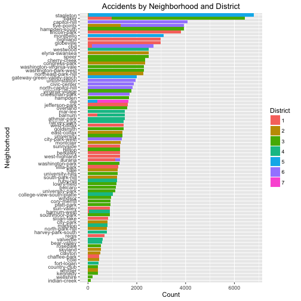

### Districts and precincts with the most accidents

```r
  traffic %>% count(DISTRICT_ID) %>% arrange(desc(n))
```

```
## # A tibble: 7 × 2
##   DISTRICT_ID     n
##        <fctr> <int>
## 1           3 39279
## 2           1 23635
## 3           6 18095
## 4           2 17071
## 5           4 14313
## 6           5 12265
## 7           7  1272
```

```r
  traffic %>% count(DISTRICT_ID, PRECINCT_ID) %>% arrange(desc(n))
```

```
## Source: local data frame [33 x 3]
## Groups: DISTRICT_ID [7]
## 
##    DISTRICT_ID PRECINCT_ID     n
##         <fctr>      <fctr> <int>
## 1            3         311 10724
## 2            5         511  7568
## 3            3         323  6912
## 4            3         313  6649
## 5            3         312  6418
## 6            1         123  6030
## 7            6         611  4896
## 8            3         322  4601
## 9            1         113  4288
## 10           3         321  3975
## # ... with 23 more rows
```

```r
  ggplot(traffic) + geom_bar(aes(x=DISTRICT_ID, fill=PRECINCT_ID)) +
    scale_x_discrete(limits = (traffic %>% count(DISTRICT_ID)
                                       %>% arrange(desc(n)))$DISTRICT_ID) +
    labs(title="Accidents by District and Precinct",
      x="District", y="Count", fill="Precinct")
```

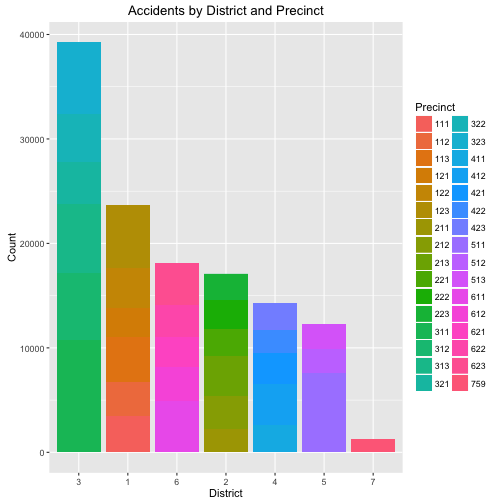

### Accidents by Offense Type

```r
  ggplot(traffic) + geom_bar(aes(x=OFFENSE_TYPE_ID)) +
    scale_x_discrete(limits = (traffic %>% count(OFFENSE_TYPE_ID)
                                       %>% arrange(n))$OFFENSE_TYPE_ID) +
    labs(title="Number of Accidents by Offense Type",
      x="Offense Type", y="Count") +
    coord_flip()
```

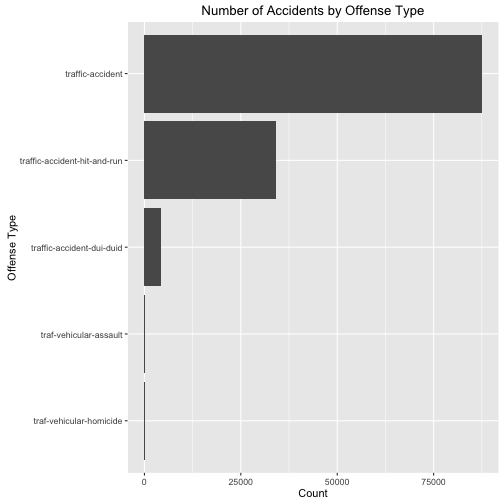

## Geo and Time Visualizations


```r
  library(ggmap)
  library(gridExtra)

  denver_central <- get_map(location="Denver", zoom=13, source="osm")
  denver_full <- get_map(location =
    c(mean(traffic$GEO_LON), mean(traffic$GEO_LAT)), zoom=12, source="osm")
```

### All Traffic Accidents (Yellow)

```r
  plot <-
    geom_point(aes(x=traffic$GEO_LON, y=traffic$GEO_LAT),
      data=traffic, col="#ffff88", alpha=0.2, size=1)

#  p1 <- ggmap(denver_full) + plot
#  p2 <- ggmap(denver_central) + plot
#  grid.arrange(p1, p2, nrow=1)

  ggmap(denver_full) + plot
```

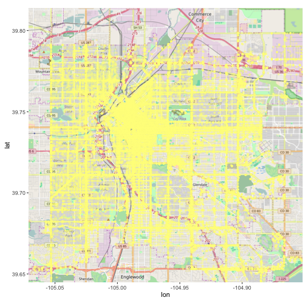

```r
  ggmap(denver_central) + plot
```

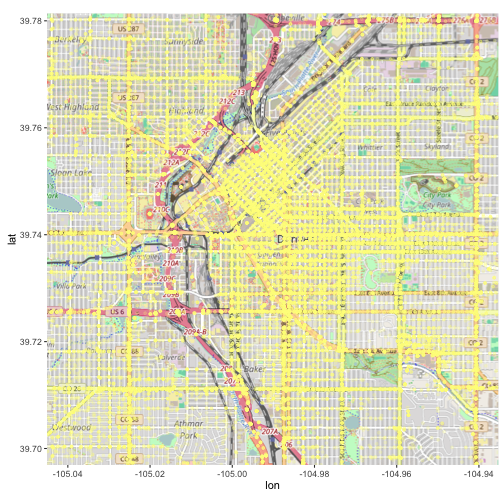

### All Accidents by Time

```r
  g1 <- ggplot(data=traffic, aes(traffic$OCCURRENCE_HOUR)) +
         geom_histogram(breaks=seq(0, 24, by=1), col="yellow",
         fill="#ffff88", alpha=0.4) + 
         labs(x="Hour of Day", y="Number of Accidents")

  g2 <- ggplot(data=traffic, aes(traffic$OCCURRENCE_DAY)) +
         geom_histogram(breaks=seq(0, 7, by=1), col="yellow",
         fill="#ffff88", alpha=0.4) + 
         labs(x="Day of Week (Mon-Sun)")

  g3 <- ggplot(data=traffic, aes(traffic$OCCURRENCE_MONTH)) +
         geom_histogram(breaks=seq(0, 12, by=1), col="yellow",
         fill="#ffff88", alpha=0.4) + 
         labs(x="Month (Jan-Dec)")

  g4 <- ggplot(data=traffic, aes(traffic$OCCURRENCE_YEAR)) +
         geom_histogram(breaks=seq(2011, 2016, by=1), col="yellow",
         fill="#ffff88", alpha=0.4) + 
         labs(x="Year")

  grid.arrange(g1, g2, g3, g4, nrow=2)
```

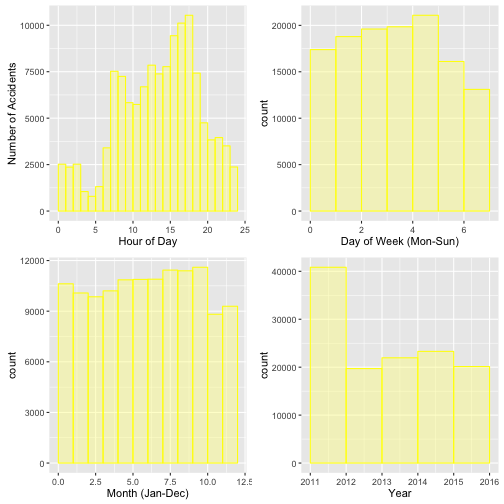

### All Incidents Involving Bicycles (Red)


```r
  g1 <-
    geom_point(aes(x=traffic$GEO_LON, y=traffic$GEO_LAT),
      data=traffic, col="#ffff88", alpha=0.2, size=1)
  g2 <-
    geom_point(aes(x=traffic$GEO_LON, y=traffic$GEO_LAT),
      data=traffic, col=ifelse(traffic$BICYCLE_IND==1, "#ff0000", "#ffff88"),
      alpha=0.4, size=1.5)

  ggmap(denver_full) + g1 + g2
```

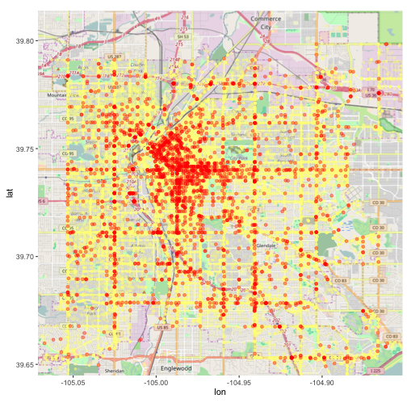

```r
  ggmap(denver_central) + g1 + g2
```

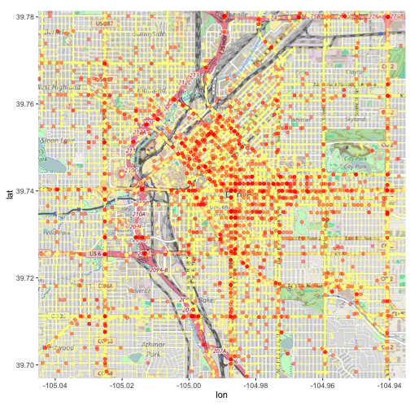

### All Incidents Involving Bicycles by Time


```r
  g1 <- ggplot(data=bicycles, aes(bicycles$OCCURRENCE_HOUR)) +
    geom_histogram(breaks=seq(0, 24, by=1), col="red",
                   fill="#ff5555", alpha=0.4) + 
    labs(x="Hour of Day", y="Number of Accidents Involving Cyclists (Red)")

  g2 <- ggplot(data=bicycles, aes(bicycles$OCCURRENCE_DAY)) +
    geom_histogram(breaks=seq(0, 7, by=1), col="red",
                   fill="#ff5555", alpha=0.4) + 
    labs(x="Day of Week (Mon-Sun)")

  g3 <- ggplot(data=bicycles, aes(bicycles$OCCURRENCE_MONTH)) +
    geom_histogram(breaks=seq(0, 12, by=1), col="red",
                   fill="#ff5555", alpha=0.4) + 
    labs(x="Month (Jan-Dec)")

  g4 <- ggplot(data=bicycles, aes(bicycles$OCCURRENCE_YEAR)) +
    geom_histogram(breaks=seq(2011, 2016, by=1), col="red",
                   fill="#ff5555", alpha=0.4) + 
    labs(x="Year")

  grid.arrange(g1, g2, g3, g4, nrow=2)
```

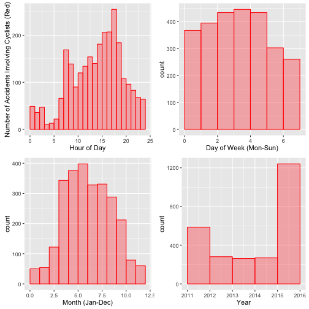

### Hit and Run Incidents Involving Bicycles (Black)


```r
  g1 <- geom_point(aes(x=traffic$GEO_LON, y=traffic$GEO_LAT),
    data=traffic, col="#ffff88", alpha=0.2, size=1)

  g2 <- geom_point(data=bicycles, aes(x=bicycles$GEO_LON, y=bicycles$GEO_LAT),
    col=ifelse( (bicycles$OFFENSE_TYPE_ID=="traffic-accident-hit-and-run"),
    "#000000", "#ff0000"), alpha=0.4, size=1.5)

  ggmap(denver_full) + g1 + g2
```


```r
  ggmap(denver_central) + g1 + g2
```


### All Hit and Run Incidents Involving Bicycles by Time


```r
  bicyclehitrun <-
    bicycles[bicycles$OFFENSE_TYPE_ID %in% c("traffic-accident-hit-and-run"), ]

  g1 <- ggplot() +
    geom_histogram(data=bicycles, aes(bicycles$OCCURRENCE_HOUR),
      breaks=seq(0, 24, by=1), col="red", fill="#ff5555", alpha=0.4) + 
    geom_histogram(data=bicyclehitrun, aes(bicyclehitrun$OCCURRENCE_HOUR),
      breaks=seq(0, 24, by=1), col="black", fill="#222222", alpha=0.4) + 
    labs(x="Hour of Day", y="Hit and Run Accidents on Cyclists (Black)")

  g2 <- ggplot() +
    geom_histogram(data=bicycles, aes(bicycles$OCCURRENCE_DAY),
      breaks=seq(0, 7, by=1), col="red", fill="#ff5555", alpha=0.4) + 
    geom_histogram(data=bicyclehitrun, aes(bicyclehitrun$OCCURRENCE_DAY),
      breaks=seq(0, 7, by=1), col="black", fill="#222222", alpha=0.4) + 
    labs(x="Day of Week (Mon-Sun)")

  g3 <- ggplot() +
    geom_histogram(data=bicycles, aes(bicycles$OCCURRENCE_MONTH),
      breaks=seq(0, 13, by=1), col="red", fill="#ff5555", alpha=0.4) + 
    geom_histogram(data=bicyclehitrun, aes(bicyclehitrun$OCCURRENCE_MONTH),
      breaks=seq(0, 13, by=1), col="black", fill="#222222", alpha=0.4) + 
    labs(x="Month (Jan-Dec)")

  g4 <- ggplot() +
    geom_histogram(data=bicycles, aes(bicycles$OCCURRENCE_YEAR),
      breaks=seq(2011, 2016, by=1), col="red", fill="#ff5555", alpha=0.4) + 
    geom_histogram(data=bicyclehitrun, aes(bicyclehitrun$OCCURRENCE_YEAR),
      breaks=seq(2011, 2016, by=1), col="black", fill="#222222", alpha=0.4) + 
    labs(x="Year")

  grid.arrange(g1, g2, g3, g4, nrow=2)
```

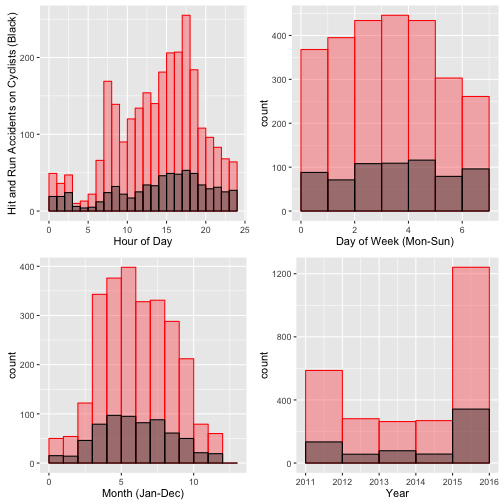

### Incidents Involving Cyclists - Hit and Run Probability


```r
  traffic_hours <- count(traffic, floor(OCCURRENCE_HOUR))
  colnames(traffic_hours) <- c("hour", "count")

  bicycles_hours <- count(bicycles, floor(OCCURRENCE_HOUR))
  colnames(bicycles_hours) <- c("hour", "count")

  bicyclehitrun_hours <- count(bicyclehitrun, floor(OCCURRENCE_HOUR))
  colnames(bicyclehitrun_hours) <- c("hour", "count")

  comparison <- bicyclehitrun_hours
  comparison$accidents <- bicycles_hours$count
  comparison$hitrun <- bicyclehitrun_hours$count
  comparison$probability <- bicyclehitrun_hours$count / bicycles_hours$count
  comparison
```

```
## # A tibble: 24 × 5
##     hour count accidents hitrun probability
##    <dbl> <int>     <int>  <int>       <dbl>
## 1      0    19        49     19   0.3877551
## 2      1    14        30     14   0.4666667
## 3      2    26        50     26   0.5200000
## 4      3     9        12      9   0.7500000
## 5      4     4        13      4   0.3076923
## 6      5     5        21      5   0.2380952
## 7      6    11        66     11   0.1666667
## 8      7    23       158     23   0.1455696
## 9      8    29       140     29   0.2071429
## 10     9    27       102     27   0.2647059
## # ... with 14 more rows
```

```r
  ggplot(comparison, aes(hour, probability)) + geom_point(size=1) +
    geom_smooth(span=1.0) + 
  labs(title="Incidents Involving Cyclists - Hit and Run Probability",
    x="Hour of Day", y="Prevalence")
```

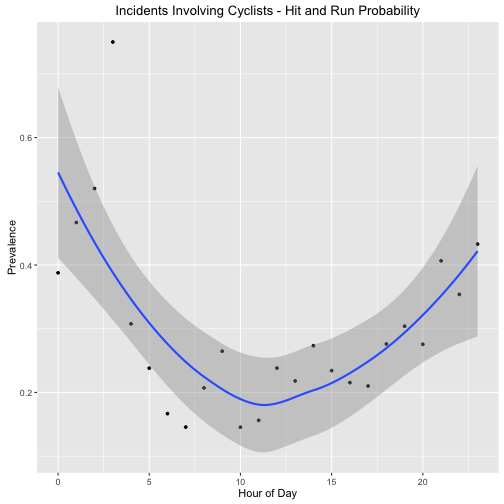

### General Hit and Run Probability

```r
  traffichitrun <-
    traffic[traffic$OFFENSE_TYPE_ID %in% c("traffic-accident-hit-and-run"), ]

  traffic_hours <- count(traffic, floor(OCCURRENCE_HOUR))
  colnames(traffic_hours) <- c("hour", "count")

  traffichitrun_hours <- count(traffichitrun, floor(OCCURRENCE_HOUR))
  colnames(traffichitrun_hours) <- c("hour", "count")

  traffic_comparison <- traffichitrun_hours
  traffic_comparison$accidents <- traffic_hours$count
  traffic_comparison$hitrun <- traffichitrun_hours$count
  traffic_comparison$probability <-
    traffichitrun_hours$count / traffic_hours$count

  ggplot(traffic_comparison, aes(hour, probability)) + geom_point(size=1) +
    geom_smooth(span=1.0) + 
  labs(title="All Traffic Incidents - Hit and Run Probability",
    x="Time of Day", y="Prevalence")
```

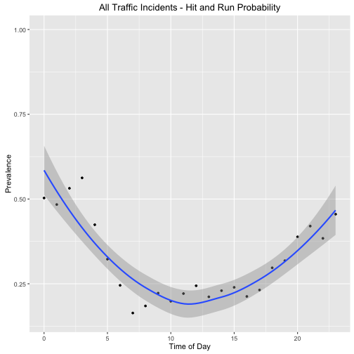

### Accidents Involving Pedestrian (Purple)


```r
    g1 <- geom_point(aes(x=traffic$GEO_LON, y=traffic$GEO_LAT), data=traffic,
      col="#ffff88", alpha=0.2, size=1)
    g2 <- geom_point(aes(x=traffic$GEO_LON, y=traffic$GEO_LAT), data=traffic,
      col=ifelse(traffic$PEDESTRIAN_IND==1, "#ff00ff", "#ffff88"), alpha=0.4,
      size=1.5)
  ggmap(denver_full) + g1 + g2
```

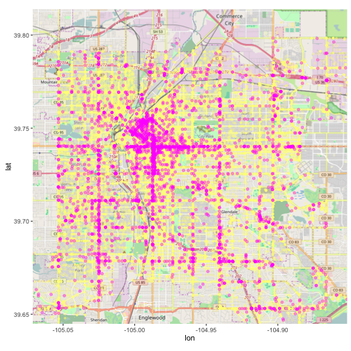

```r
  ggmap(denver_central) + g1 + g2
```

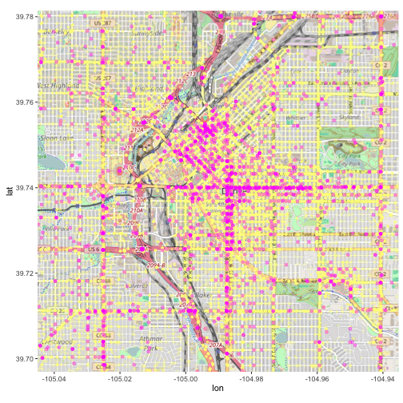

### Hit and Run on Pedestrians (Black)

```r
  pedestrians <- traffic[traffic$PEDESTRIAN_IND %in% c(1), ]
  g1 <- geom_point(aes(x=traffic$GEO_LON, y=traffic$GEO_LAT), data=traffic,
    col="#ffff88", alpha=0.2, size=1) 
  g2 <- geom_point(data=pedestrians, aes(x=pedestrians$GEO_LON,
    y=pedestrians$GEO_LAT),
    col=ifelse( (pedestrians$OFFENSE_TYPE_ID=="traffic-accident-hit-and-run"),
    "#220022", "#ff00ff"), alpha=0.4, size=1.5, position="jitter")

  ggmap(denver_full) + g1 + g2
```

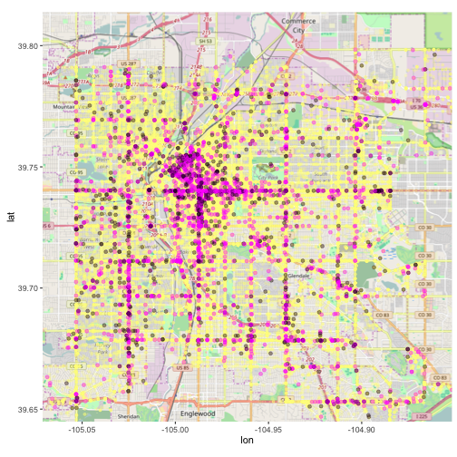

```r
  ggmap(denver_central) + g1 + g2
```

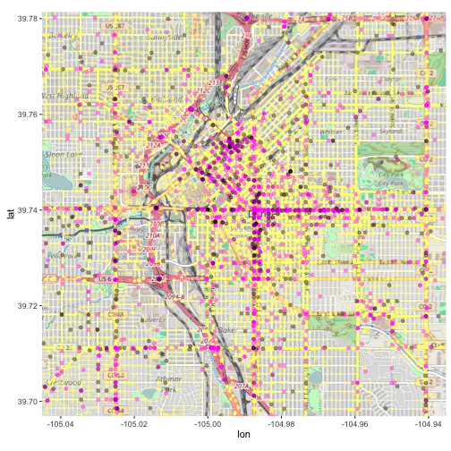

## Summary Stats

### Earliest Incident

```r
  head(sort(traffic$FIRST_OCCURRENCE_DATE), 1)
```

```
## [1] "2011-01-02 00:21:59 MST"
```

### Latest Incident

```r
  tail(sort(traffic$FIRST_OCCURRENCE_DATE), 1)
```

```
## [1] "2016-11-04 02:00:00 MDT"
```

### Total Number of Incidents

```r
  total_incidents <- nrow(traffic)
  total_incidents
```

```
## [1] 125930
```

### Number of Hit and Run Incidents

```r
  hit_and_run_incidents <-
    nrow(bicycles[traffic$OFFENSE_TYPE_ID %in%
      c("traffic-accident-hit-and-run"), ])
  hit_and_run_incidents
```

```
## [1] 34041
```

### Number of Vehicular Homicides

```r
  nrow(traffic[traffic$OFFENSE_TYPE_ID %in% c("traf-vehicular-homicide"), ])
```

```
## [1] 31
```

### Number of Incidents on Bicycles

```r
  bicycle_incidents <- nrow(bicycles)
  bicycle_incidents
```

```
## [1] 2641
```

### Number of Incidents on Pedestrians

```r
  pedestrian_incidents <- nrow(pedestrians)
  pedestrian_incidents
```

```
## [1] 3538
```

### Number of Hit and Run Incidents on Bicycles

```r
  bicycle_hit_and_run_incidents <-
    nrow(bicycles[bicycles$OFFENSE_TYPE_ID %in%
      c("traffic-accident-hit-and-run"), ])
  bicycle_hit_and_run_incidents
```

```
## [1] 667
```

### Number of Vehicular Homicides on Bicycles

```r
# aka "killing cyclists is always an 'accident'"
  nrow(bicycles[bicycles$OFFENSE_TYPE_ID %in% c("traf-vehicular-homicide"), ])
```

```
## [1] 0
```

### Number of Hit and Run Incidents on Pedestrians

```r
  pedestrian_hit_and_run_incidents <-
    nrow(pedestrians[pedestrians$OFFENSE_TYPE_ID %in%
      c("traffic-accident-hit-and-run"), ])
  pedestrian_hit_and_run_incidents
```

```
## [1] 1108
```

### Cyclist Incidents, Percentage Hit and Run

```r
  cyclist_hit_and_run_percentage <-
    bicycle_hit_and_run_incidents * 100 / bicycle_incidents
  cyclist_hit_and_run_percentage
```

```
## [1] 25.25559
```

### Total Incidents, Percentage Hit and Run

```r
  hit_and_run_percentage <- hit_and_run_incidents * 100 / total_incidents
  hit_and_run_percentage
```

```
## [1] 27.03168
```

### Pedestrian Incidents, Percentage Hit and Run

```r
  pedestrian_hit_and_run_percentage <-
    pedestrian_hit_and_run_incidents * 100 / pedestrian_incidents
  pedestrian_hit_and_run_percentage
```

```
## [1] 31.31713
```

### Incidents on a Specific Street

```r
  length(which(grepl("COLFAX", bicycles$INCIDENT_ADDRESS)))
```

```
## [1] 159
```

## Density Heatmaps

### Density - All Incidents

```r
  ggmap(denver_full) +
    geom_density2d(data = traffic, aes(x=traffic$GEO_LON, y=traffic$GEO_LAT)) +
    stat_density2d(data = traffic, aes(x=traffic$GEO_LON, y=traffic$GEO_LAT,
      fill = ..level.., alpha = ..level..),
      size = 1.0, bins = 16, geom = 'polygon') +
   scale_fill_gradient(low = "green", high = "red") +
   scale_alpha(range = c(0.00, 0.4), guide = FALSE) 
```

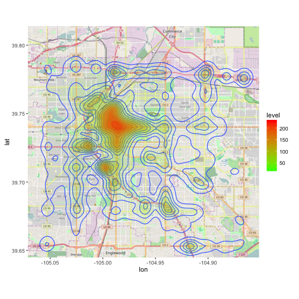

### Density - Bicycle Incidents

```r
  ggmap(denver_full) +
    geom_density2d(data = bicycles, aes(x=bicycles$GEO_LON,
      y=bicycles$GEO_LAT)) +
   stat_density2d(data = bicycles, aes(x=bicycles$GEO_LON, y=bicycles$GEO_LAT,
     fill = ..level.., alpha = ..level..),
     size = 1.0, bins = 16, geom = 'polygon') +
   scale_fill_gradient(low = "green", high = "red") +
   scale_alpha(range = c(0.00, 0.4), guide = FALSE) 
```

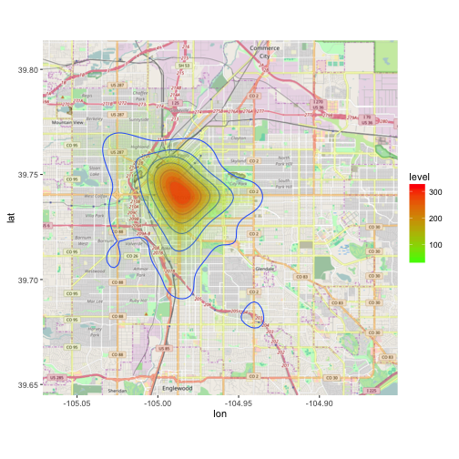

### Interactive Map - Bicycle Incidents
[Denver Bicycle Incident Map](https://pchuck.shinyapps.io/denver-bicycle-incident-map/)

